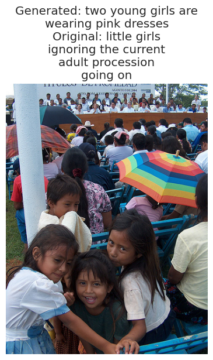
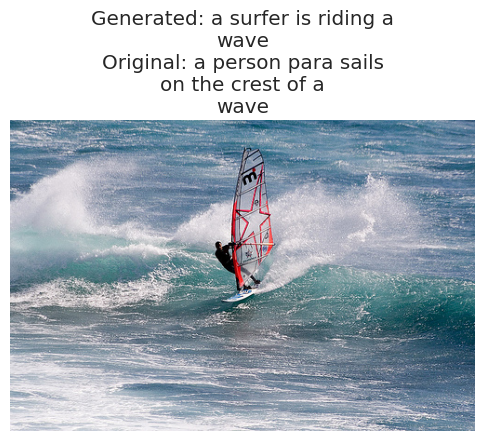
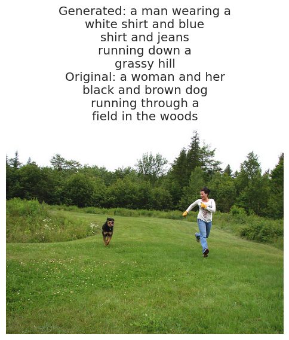

# Image Captioning using BLIP on Flickr8K Dataset

## 🚀 Overview
This project implements an end-to-end Image Captioning system using BLIP (Bootstrapping Language-Image Pretraining) on the Flickr8K Dataset. The core idea is to convert an input image into a meaningful, human-readable caption using a pre-trained multimodal transformer.

## 💡 Motivation
Automatically generating captions for images is a fundamental task combining computer vision and natural language processing. Applications range from assistive tech for the visually impaired to content management systems and intelligent search tools.

## 📚 Dataset
- **Name**: Flickr8K
- **Size**: ~8,000 images
- **Captions**: 5 human-written captions per image
- **Source**: Flickr

The dataset is preprocessed to clean text, fix image paths, and split into training and validation sets.

## 🧠 Model Architecture
- **Base Model**: Salesforce's BLIP (image-captioning-base)
- **Image Encoder**: Vision Transformer (ViT)
- **Text Decoder**: Transformer-based LM
- **Library Used**: Hugging Face's `transformers`

## 🔧 Implementation Highlights
- Preprocessing handled via `BLIPProcessor`
- Model fine-tuned using PyTorch
- Optimizer: `AdamW`
- Early stopping based on validation loss
- GPU-accelerated training for speed.

## 📊 Results
| Epoch | Training Loss | Validation Loss |
|-------|---------------|-----------------|
| 1     | 2.5597        | 2.2686          |
| 2     | 1.8804        | 2.1271          |

### 💬 Output Images

|             |             |
|-------------|-------------|
|  |  |
|  |  |


## 🏁 Future Scope
- Expand to larger datasets like MS-COCO
- Improve evaluation metrics (CIDEr, SPICE)
- Deploy real-time caption generation API

## 📦 Installation
```bash
git clone https://github.com/saicharan0623/Image-Captioning-using-BLIP-on-Flickr8k-Dataset.git
cd Image-Captioning-using-BLIP-on-Flickr8k-Dataset
pip install -r requirements.txt
```

## 💻 Usage
```python
python train.py
python infer.py --image_path path/to/image.jpg
```

## 🤝 Contributors
- Sai Charan M
- Ananya Peddamgari
- Pujitha Charala

## 📄 License
This project is licensed under the MIT License.

---
Happy Captioning! 🎉

> For more information, check out the [Project Report](https://github.com/saicharan0623/Image-Captioning-using-BLIP-on-Flickr8k-Dataset.git)!

